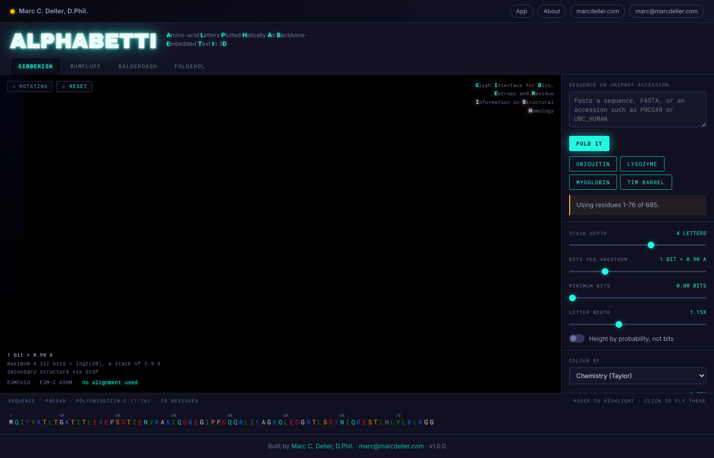
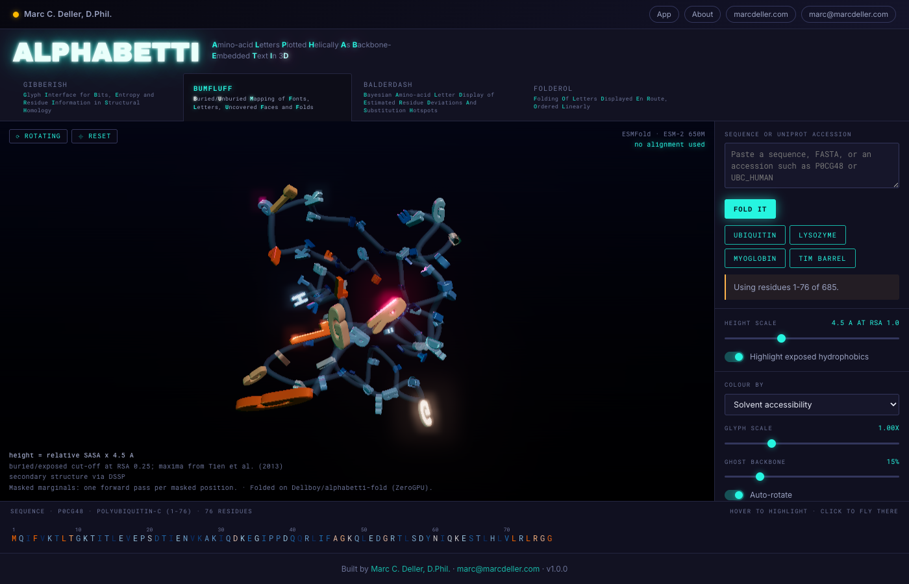
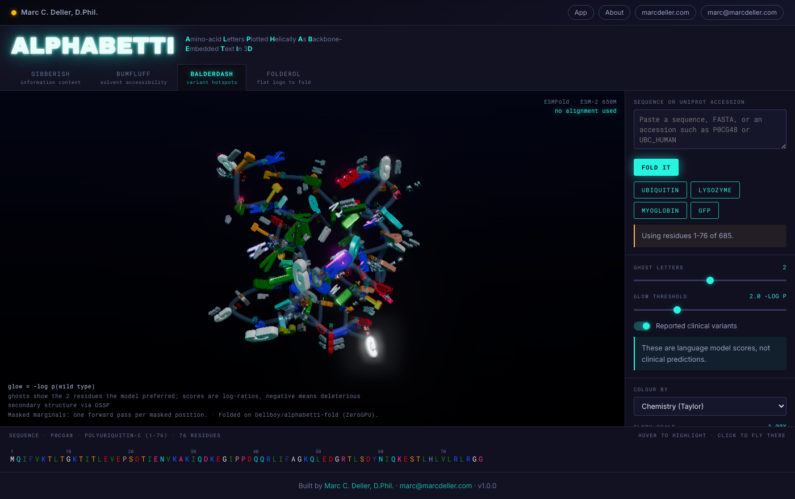

# 🔤 ALPHABETTI

**A**mino-acid **L**etters **P**lotted **H**elically **A**s **B**ackbone-**E**mbedded **T**ext in **T**hree-dimensions and **I**nteractive

> **A protein sequence logo, in three dimensions, wrapped around its own predicted structure.**

[](https://alphabetti.mdeller.com)


| | |
|---|---|
| 🌐 **App** | [alphabetti.mdeller.com](https://alphabetti.mdeller.com) |
| 🧬 **Fold service** | [Dellboy/alphabetti-fold](https://huggingface.co/spaces/Dellboy/alphabetti-fold) on Hugging Face ZeroGPU |
| ✉️ **Contact** | [marc@marcdeller.com](mailto:marc@marcdeller.com) |
| 👤 **Author** | Marc C. Deller, D.Phil. |



**ALPHABETTI** draws a protein's own single-letter amino acid codes in 3D, positioned and oriented along an ESMFold-predicted backbone. Instead of a cartoon or a stick model, you get the letters themselves: stacked at each position by how strongly a protein language model expects them, tallest at the bottom, standing on the side chain.

**Why it matters:** a conventional sequence logo tells you which positions are conserved, but it does so on a flat strip that has been divorced from the structure, and it gets there through a multiple sequence alignment, inheriting every bias in the search-align-trim pipeline that produced it. ALPHABETTI has **no alignment anywhere**: it asks ESM-2 what it expects at each position, having first masked that position so the model cannot read the answer off its own input, and then wraps the answer onto the fold. Conserved buried core positions become tall single-letter towers, tolerant surface positions splay into short scruffy stacks, and helices read as spiral staircases of text. It is useful for: seeing at a glance which parts of a fold a model considers load-bearing, spotting exposed hydrophobic patches that drive aggregation or block crystallisation, finding positions where the wild-type residue is one the model would not have chosen, and producing something that people will actually share.

## 🧪 One view, five modes

There are no tabs. The structure, the camera and the sequence ruler are shared, and the mode buttons on the canvas change only what the glyphs mean. Everything is computed once, shipped in one payload, and switches instantly with no further network round trip.

| Mode | Name | Glyph geometry is driven by |
|---|---|---|
| **Information** | GIBBERISH | Glyph Interface for Bits, Entropy and Residue Information in Structural Homology | ESM-2 per-position probabilities, heights in bits of information content |
| **Solvent** | BUMFLUFF | Buried/Unburied Mapping of Fonts, Letters, Uncovered Faces and Folds | Relative solvent accessible surface area |
| **Hotspots** | BALDERDASH | Bayesian Amino-acid Letter Display of Estimated Residue Deviations And Substitution Hotspots | Variant effect scores, ghost glyphs, ClinVar/gnomAD overlay |
| **Fold** | FOLDEROL | Folding Of Letters Displayed En Route, Ordered Linearly | An animated morph from a flat 2D logo strip into the 3D coordinates |
| **Logo** | HOGWASH | Height-Ordered Glyphs Weighted Across Sequence Homologues | A real [WebLogo](https://github.com/gecrooks/weblogo) from a real alignment: the one tab that uses one |



## 🐖 HOGWASH: the one tab with an alignment

Every other tab asks a language model what it expects and uses **no alignment anywhere**. HOGWASH is the opposite and the older idea: count what evolution actually did in a column of aligned homologues. Both are here so they can be compared.

It is a real WebLogo, not a lookalike. [WebLogo 3](https://github.com/gecrooks/weblogo) (MIT, used unmodified) does all of it: the column counts, the composition priors and pseudocounts, the small-sample correction, the unit conversions, the colour schemes, and the rendered EPS/PDF/PNG/SVG. ALPHABETTI supplies the alignment plumbing and a second rendering of the same `LogoData`.

- **The logo is 3D and interactive**, not a picture. Four arrangements: **helix** (a spiral tower, the default and the right one for a long family), **ring** (a crown you orbit or drop into), **strip** and **rows**. Orbit it, zoom right down to one column, click a column to pin its counts and fly there.
- **Input**: paste or upload FASTA, CLUSTAL, Stockholm, PHYLIP, MSF and six other formats, or fetch the current protein's Pfam seed alignment from InterPro.
- **Every WebLogo option**: units (bits, nats, probability, kT, kJ/mol, kcal/mol, digits), background composition, small-sample correction, alphabet, colour scheme, error bars, stacks per line.
- **Authentic output**: PNG, PDF, SVG, EPS, JPEG, CSV and WebLogo's own `logodata` text. The flat WebLogo is the **publication figure**, generated by WebLogo itself; it is an export rather than the way you look at the thing.
- **Five bundled example alignments**, WebLogo's own, so the tab works when InterPro does not.

> **Please cite WebLogo.** Crooks GE, Hon G, Chandonia JM, Brenner SE (2004). WebLogo: a sequence logo generator. *Genome Research* **14**(6):1188-1190. [doi:10.1101/gr.849004](https://doi.org/10.1101/gr.849004) · [PMC419797](https://pmc.ncbi.nlm.nih.gov/articles/PMC419797/)

Licence text and all other dependencies: [`THIRD-PARTY.md`](THIRD-PARTY.md).

## 📐 How a stack is built

```
H_i      = -sum_a p_a log2(p_a)      Shannon entropy, bits
R_i      = log2(20) - H_i            information content, maximum 4.322 bits
height_a = p_a * R_i                 per-letter height, bits
```

Letters are stacked along the residue's own side-chain direction, each standing on the one below, so **the total height of a stack is that position's information content**. A unit test checks this against hand-calculated values, because it is the difference between a quantitative picture and a decorative one.

No small-sample entropy correction is applied. The usual correction compensates for estimating a distribution from a finite number of aligned sequences; here there is no alignment and no sample, so correcting would subtract a bias that does not exist.

## 🔬 Scientific choices, and what they were checked against

| Quantity | Method | Validation |
|---|---|---|
| Structure | ESMFold (`facebook/esmfold_v1`) | **0.84 Å CA RMSD** for ubiquitin against the 1UBQ crystal structure |
| Expectation | ESM-2 650M (`facebook/esm2_t33_650M_UR50D`), **masked** marginals | Unmasked marginals return the wild type at 100 % of positions; see below |
| pLDDT | ESMFold's B-factor column | Normalised and asserted to 0-100; a 0-1 scale renders as a uniformly unconfident protein |
| Relative SASA | FreeSASA, 1.4 Šprobe, over Tien et al. (2013) theoretical maxima | Total SASA 4804 Ų for 1UBQ against a published value of about 4800 |
| Secondary structure | DSSP where present, else P-SEA from CA positions | **83.7 %** three-state agreement with DSSP over 805 residues of ten chains |
| Virtual Cβ | Standard tetrahedral construction from N, CA, C | **0.13 Å mean** deviation from the real Cβ across all 70 non-glycine residues of 1UBQ |
| Variant score | `log p(mutant) - log p(wild type)`, ESM-1v convention | Wild-type entry is exactly zero by construction; **negative means deleterious** |

Glycine has no Cβ, so one is constructed and glycines are **never skipped**: a hole at every glycine would be a hole at exactly the positions where backbones turn.

### Masked marginals are the default, and that is a change from the brief

The original specification made masked marginals an opt-in toggle, "L times slower". They are, and on a CPU that would settle it. On a GPU it does not, and the cheap option is actively misleading. Measured on ubiquitin:

| | Wild-type marginals | Masked marginals |
|---|---|---|
| Top-1 equals wild type | **100 %** | 80 % |
| Mean information content | 4.01 bits | **3.20 bits** |
| Language model time | 0.03 s | 0.42 s (about 2.2 s at 400 residues) |

An unmasked forward pass can read each residue off its own input, so it returns near-maximal confidence everywhere and GIBBERISH becomes a 3D rendering of the input sequence. Set `ALPHABETTI_MASKED_MARGINALS=0` to compare.

### Where it fails

ESM-2 has almost no evolutionary signal for avGFP: masked marginals recover the wild-type residue at **10 %** of positions against **8 %** for a randomly shuffled version of the same sequence, and mean information content is 0.27 of a possible 4.322 bits. Because ESMFold's trunk *is* ESM-2, the structure fails with it rather than independently, at mean pLDDT 42.8. The two never contradict each other, so nothing on screen flags it except the confidence number. **Check the pLDDT before believing a picture.**

### Examples name a residue range, deliberately

A UniProt sequence is the **precursor**, and folding it whole gives something nobody means. P0CG48 is nine exact tandem copies of ubiquitin (and the repeats let a masked model copy each position from its neighbours, driving information content to near-maximal everywhere). P00698 carries an 18-residue signal peptide that is cleaved in vivo, has no structure of its own, and trails off the fold as a disordered tail. Every example therefore names a range taken from UniProt's own Chain feature. Removing lysozyme's signal peptide raised its mean pLDDT from **91.0 to 95.1**.



## 🎥 The camera turns nothing; the protein does

Dragging vertically used to die about halfway across the viewport. The cause is in three.js OrbitControls' own arithmetic rather than anything app-specific, which is why sibling apps had it too:

```js
rotateUp( 2 * Math.PI * deltaY / element.clientHeight * rotateSpeed )
```

A full canvas height of vertical drag asks for **360°** of polar rotation, while the polar angle is clamped to **[0, π] = 180°**. Half a viewport therefore exhausts the entire permitted range and the camera pins at the pole. Measured: the polar angle stopped changing at **59%** of a vertical drag. Halving the sensitivity only moved that to 91%, because a spherical-coordinate camera *has* a pole and the clamp exists to protect its degenerate up vector.

ALPHABETTI now uses `StageCamera`, taken unchanged from ButtFold (itself ported from PhoneFold's Swift). **The camera is fixed on +Z and the protein carries a quaternion**, so there is no pole to protect and it tumbles freely. Drag increments are premultiplied about the *screen* axes, which keeps "drag right turns right" true even upside down. Measured after: a full vertical drag turns 137° with zero dead steps, and dragging again the same way turns another 137°.

The orbit resumes **8 seconds** after you stop, not 2.5: a view you have just set should not start sliding away while you are still looking at it.

## 🏗️ Architecture

```
Browser (three.js r169, vanilla ES modules, no build step)
        |  JSON over fetch()
        v
Flask + Gunicorn on the mdeller.com droplet
        |-- SQLite cache, keyed on sha256(sequence)
        |-- bounded thread pool, job state in SQLite
        v  HTTPS
Hugging Face ZeroGPU Space
        |-- ESMFold          -> coordinates + pLDDT
        `-- ESM-2 650M       -> a 20 x L probability matrix
```

**The fold does not run on the droplet, and cannot.** That box has 3.9 GB of RAM with about 2.0 GB free, two cores, and eight other applications already on it; the `esmfold_v1` checkpoint alone is 7.9 GB of fp32 weights, and a 400-residue fold needs several more gigabytes for the L x L pair representation. It is short by a factor of four to six.

So the Space returns nothing but coordinates and probabilities, and **every derived quantity is computed in this repository** — information content, entropy, variant scores, accessibility, secondary structure, per-residue frames — in modules that need neither a GPU nor a network and are unit-tested without one. The science does not move when the compute does.

That decision also removed Redis and RQ. With no models to hold, a job spends its entire life waiting on one HTTPS request, which is what threads are for; job state lives in SQLite so both Gunicorn workers can see it.

## ⚙️ Options

Every setting is an environment variable. See `.env.example`.

| Variable | Default | What it does |
|---|---|---|
| `ALPHABETTI_FOLD_BACKEND` | `hf_space` | `hf_space`, `local` (torch in-process, needs ~16 GB), or `none` (cache only) |
| `ALPHABETTI_HF_SPACE` | `Dellboy/alphabetti-fold` | The Space that holds the models |
| `HF_TOKEN` | *(none)* | Required in practice: the anonymous ZeroGPU quota is a handful of folds and runs out with an error that does not mention quota |
| `ALPHABETTI_MASKED_MARGINALS` | `1` | Masked marginals; `0` gives the faster, misleading unmasked pass |
| `ALPHABETTI_MAX_LENGTH` | `400` | Longer input is refused with an offer to truncate, naming the exact range kept |
| `ALPHABETTI_MIN_LENGTH` | `10` | |
| `ALPHABETTI_FOLD_TIMEOUT` | `900` | Seconds before a fold is given up on cleanly |
| `ALPHABETTI_MAX_CONCURRENT` | `2` | Concurrent folds; ZeroGPU serialises anyway and quota is per account |
| `ALPHABETTI_TOP_K` | `6` | Amino acids per position carried in the payload |
| `ALPHABETTI_CACHE` | `instance/alphabetti.sqlite` | Cache database |
| `ALPHABETTI_ENABLE_UNIPROT` | `1` | Accession and entry-name lookup |
| `ALPHABETTI_ENABLE_VARIANTS` | `1` | EBI Proteins API overlay for BALDERDASH |

## 📤 Outputs

| Format | Route | Notes |
|---|---|---|
| PDB | `/api/download/<id>.pdb` | The predicted structure, pLDDT in the B-factor column |
| JSON | `/api/download/<id>.json` | The full payload that drives all four tabs |
| CSV | `/api/download/<id>.csv` | Per residue: resnum, aa, pLDDT, RSA, SASA, SS, bits, entropy, surprise |
| GLB | in-app | Baked instanced geometry with vertex colours, for Blender or AR |
| STL | in-app | For printing; letters are separate shells and the app says so |
| PNG | in-app | 1x, 2x, 4x, with a transparent-background option |
| GIF | in-app | One FOLDEROL loop, with a resolution selector |

## 🚀 Running it

```bash
git clone https://github.com/bellcheddar/ALPHABETTI.git
cd ALPHABETTI
python3 -m venv .venv
.venv/bin/pip install -r requirements.txt
cp .env.example .env          # add HF_TOKEN
.venv/bin/python app.py       # http://127.0.0.1:8006
```

The four examples are committed as computed payloads, so the app shows a rotating protein before it has ever reached a GPU.

```bash
.venv/bin/python -m pytest tests/ -q          # 49 tests, no GPU, no network
.venv/bin/python scripts/prewarm.py           # recompute the examples
.venv/bin/python scripts/make_typeface.py /path/to/font.ttf out.json 700
.venv/bin/python scripts/make_icon.py         # icon, favicon, OG card
```

Deployment: `deploy/provision.sh` once, `deploy/deploy.sh` thereafter.

## ✅ To Do

- [x] **Backend science modules** — geometry, language model, accessibility and sequence handling, all pure numpy and Biopython, unit-tested with no GPU and no network.
- [x] **Per-residue frames** — orthonormal, right-handed, with a degenerate-case guard and both termini handled; mirrored function for function in `orientation.js` for FOLDEROL.
- [x] **Virtual Cβ for glycine** — validated to 0.13 Å mean against real Cβ positions in 1UBQ. Never skipped.
- [x] **Fixed a 180° dihedral sign error** — helices sat at −129° where P-SEA publishes +50°, so every angle criterion silently failed. The CA-only secondary structure assignment went from 55 % to **83.7 %** against DSSP. This matters because `mkdssp` is not on the droplet, making the fallback the production path.
- [x] **Caught DSSP failing on every structure** — `mkdssp` rejects any file with no PDB `HEADER` line and ESMFold emits none, while a bare `except: pass` reported it as merely absent.
- [x] **ZeroGPU fold service** — ESMFold and ESM-2 650M behind a JSON API, 12.7 s wall for a first fold against an estimated 3-8 minutes on a CPU droplet.
- [x] **Masked marginals by default** — after measuring that unmasked marginals return the wild type at 100 % of positions.
- [x] **Instanced glyph renderer** — one `InstancedMesh` per amino acid, twenty draw calls regardless of chain length.
- [x] **Baloo 2 to `typeface.json`** — with the curve argument order verified against the source outlines to 0.34 %.
- [x] **All four tabs** against a single payload, switching with no network round trip.
- [x] **Four examples spanning the fold classes** — beta-grasp, mixed alpha/beta, all-alpha and a TIM barrel, each folding above pLDDT 90, each using its mature chain rather than the UniProt precursor.
- [x] **Exports** — GLB, STL, PNG at 1x/2x/4x, and an animated GIF over one FOLDEROL loop.
- [x] **49 tests**, including regressions for the bugs found during the build.
- [x] **`BENCHMARKS.md`** with real timings from the machines that serve the app.
- [x] **Neon Signage visual direction**, chosen from five rendered candidates.
- [ ] **DNS and TLS** — `alphabetti.mdeller.com` needs an A record to 45.55.102.228 and a certbot certificate; mdeller.com's certificate does not cover subdomains.
- [ ] **Add to the mdeller.com launcher** — one entry at the top of `apps.json`, with the beacon pointing at the 3D typeface, since a scanner never fetches it.
- [x] **HOGWASH** — a real WebLogo from a real alignment, with every WebLogo option exposed, seven output formats, Pfam fetch and five bundled example alignments.
- [x] **HOGWASH in 3D** — the logo is drawn in the glyph engine as a helix, ring, strip or rows, orbited and zoomed like everything else. The flat WebLogo is now an export only.
- [ ] **HOGWASH in 3D** — map the alignment's columns onto the structure and compare, per position, what evolution did against what the language model expects. The `LogoData` is already in the payload; the gap-to-residue mapping is not built.
- [ ] **BALDERDASH substitution heatmap panel** — the 20 x L matrix is already in the payload and colour-mapped; the clickable panel that flies the camera to a position is not built.
- [ ] **Mobile testing on a real phone** — the bottom-sheet layout and pinch-zoom are written but have only been checked at emulated widths.
- [ ] **Verify GLB and STL open in Blender** — the exporters run and produce files of a sensible size, but nobody has opened one yet.
- [ ] **Revisit the 400-residue cap** — set against an assumed CPU fold of minutes; at 32 s on ZeroGPU the honest constraint is now quota and payload size.
- [ ] **A second fold backend** — the Space is a single point of failure, and `FoldBackend` already has the seam for a fallback.

## 📄 Licence

MIT.

## 🙏 Citations

- Lin Z, Akin H, Rao R, *et al.* (2023) Evolutionary-scale prediction of atomic-level protein structure with a language model. *Science* **379**:1123-1130.
- Meier J, Rao R, Verkuil R, *et al.* (2021) Language models enable zero-shot prediction of the effects of mutations on protein function. *NeurIPS*.
- Tien MZ, Meyer AG, Sydykova DK, Spielman SJ, Wilke CO (2013) Maximum allowed solvent accessibilities of residues in proteins. *PLoS ONE* **8**(11):e80635.
- Labesse G, Colloc'h N, Pothier J, Mornon JP (1997) P-SEA: a new efficient assignment of secondary structure from Cα trace of proteins. *CABIOS* **13**:291-295.
- Schneider TD, Stephens RM (1990) Sequence logos: a new way to display consensus sequences. *Nucleic Acids Research* **18**:6097-6100.
- Kabsch W, Sander C (1983) Dictionary of protein secondary structure. *Biopolymers* **22**:2577-2637.
- Kyte J, Doolittle RF (1982) A simple method for displaying the hydropathic character of a protein. *J Mol Biol* **157**:105-132.

---

Built by **Marc C. Deller, D.Phil.** · [marcdeller.com](https://marcdeller.com) · [marc@marcdeller.com](mailto:marc@marcdeller.com)
